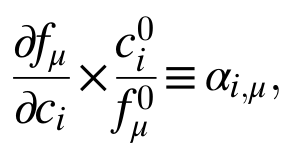
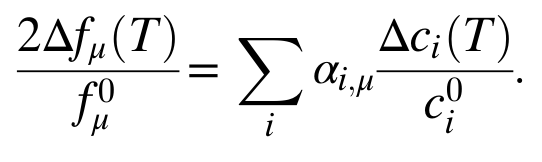

# Elastic Moduli Confirmation
 Implementation of "sanity check" from Ramshaw paper. 10.1073/pnas.1421174112

The specific procedure is taken from the supporting supporting information to double check the accuracy of computed elastic moduli. We calculate the ɑ coefficients from equations S1 and S2.

As a sanity check, the alphas should sum up to one. But, it's off by a factor of two on the provided example TMD data.